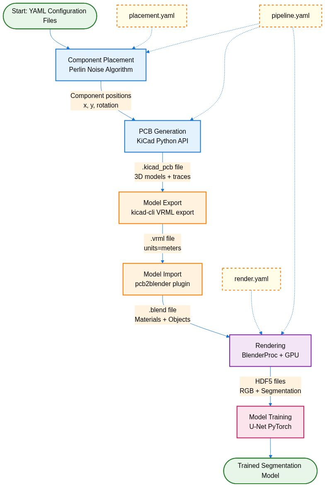
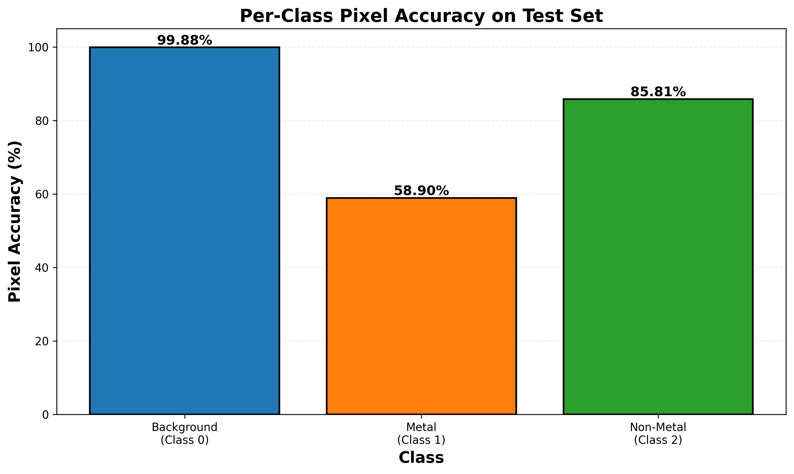
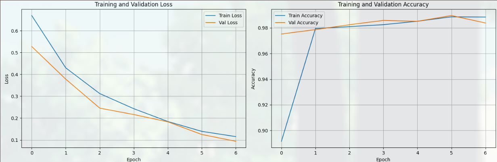

# PCB Dataset Generator

Production-ready pipeline for generating machine learning datasets of realistic PCB images with segmentation ground truth.

## Overview

PCBs are ubiquitous in electronics, but automated analysis tools for hardware debugging lag far behind software debugging capabilities. Existing PCB datasets for machine learning are limited: bounding box datasets lack precision for probe placement, defect datasets don't provide spatial information, and segmentation datasets are too small (typically <100 images) for training robust models across varied PCB designs.

This project addresses these limitations by providing a **fully automated, highly configurable pipeline** for generating synthetic PCB datasets with pixel-perfect segmentation labels. The system uses procedural generation techniques inspired by video game map generation to create realistic PCB layouts, then renders them with photorealistic materials and automatically generates segmentation ground truth.

### Pipeline Architecture

The pipeline consists of 5 main stages:



1. **Component Placement**: Perlin noise-based procedural algorithm creates organic component layouts with 40+ component types
2. **PCB Generation**: KiCad Python API generates complete PCB files with traces, routing, and 3D models
3. **Model Export/Import**: Headless export via kicad-cli and pcb2blender bridge to Blender
4. **Rendering**: BlenderProc creates photorealistic renders with automatic material-based segmentation
5. **Model Training**: Example U-Net implementation demonstrates dataset utility for metal/non-metal segmentation

### Example Output

The pipeline generates high-quality synthetic PCB images with corresponding segmentation masks:


Each sample includes RGB images and multiple segmentation maps (metal, non-metal, background, instance, etc.) in HDF5 or COCO format.

### Results

A proof-of-concept dataset of 689 samples was generated and used to train a U-Net segmentation model:



**Training Results:**
- Overall pixel accuracy: **98.5%** on synthetic test data
- Training time: ~10 minutes on Google Colab (Tesla T4)
- Model: 31M parameter U-Net trained for 50 epochs
- Best model selected at epoch 6 (validation loss: 0.0939)



**Per-class performance:**
- Background: 99.88% accuracy
- Metal components: 58.90% accuracy
- Non-metal components: 85.81% accuracy
- Mean IoU: 77.87%

The main limitation is the **sim-to-real gap** - while the model performs excellently on synthetic data, it struggles on real-world PCB images due to lighting, texture, and style differences. Future work will focus on domain randomization, higher rendering resolution, and style transfer techniques to close this gap.

**For more details, see the full paper in [`report/pcb_segmentation_paper.pdf`](report/pcb_segmentation_paper.pdf).**

---

## Key Features

- **Organic Component Placement**: Perlin noise-based clustering for realistic layouts
- **Automated PCB Generation**: KiCad Python API for programmatic board creation
- **Photorealistic Rendering**: BlenderProc with physically-based materials
- **Segmentation Ground Truth**: Material-based segmentation (metal vs non-metal parts)
- **HPC-Ready**: Containerized, SLURM-compatible for cluster deployment
- **Scalable**: Generate thousands of high-resolution samples in parallel

## Quick Start

### Local Development

1. **Setup environment**:
   ```bash
   uv venv venv
   source venv/bin/activate
   uv pip install -e .
   ```

2. **Initialize pcb2blender submodule**:
   ```bash
   git submodule update --init --recursive
   ```

3. **Configure pipeline**:
   Edit YAML files in `config/`:
   - `placement.yaml` - Component placement parameters
   - `render.yaml` - Camera and lighting settings
   - `pipeline.yaml` - Dataset generation settings

4. **Generate single sample**:
   ```bash
   python scripts/generate_single.py --sample-id 0 --output-dir data/output
   ```

5. **Generate batch locally**:
   ```bash
   python scripts/generate_batch.py --num-samples 10 --output-dir data/output
   ```

### Docker

1. **Build container**:
   ```bash
   docker build -t pcb-dataset:latest .
   ```

2. **Run**:
   ```bash
   docker run -v $(pwd)/data:/data pcb-dataset:latest \
       python /app/scripts/generate_single.py --sample-id 0 --output-dir /data/output
   ```

### HPC Cluster (Apptainer/Singularity)

The Docker image is available on Docker Hub and can be used with Apptainer for GPU-accelerated rendering on HPC clusters.

1. **Pull image from Docker Hub**:
   ```bash
   # Request interactive session first (login nodes often restricted)
   srun -p msismall --time=1:00:00 --mem=16G --cpus-per-task=4 --tmp=50G --pty bash

   # Navigate to scratch space
   cd /scratch.global/$USER/pcb_data

   # Pull the container image
   apptainer pull docker://zradlicz17/pcb-dataset-generator:latest
   ```
   This creates `pcb-dataset-generator_latest.sif`

2. **Setup configuration files**:
   ```bash
   # Copy config files to scratch space
   cp -r /path/to/pcb-dataset-generator/config /scratch.global/$USER/pcb_data/
   ```

3. **Request interactive GPU session** (for testing):
   ```bash
   srun -p msigpu --gres=gpu:a100:1 --time=4:00:00 --mem=64G --pty bash
   ```

4. **Run batch generation in interactive session** (for testing):
   ```bash
   # Ensure you're in an interactive GPU session first
   cd /scratch.global/$USER/pcb_data

   apptainer exec --nv \
       --bind "/scratch.global/$USER/pcb_data:/data" \
       --bind "/scratch.global/$USER/pcb_data/config:/app/config:ro" \
       --bind "/scratch.global/$USER/pcb_data/blender_cache:/root/.cache/cycles" \
       ./pcb-dataset-generator_latest.sif \
       python3 /app/scripts/generate_batch.py \
           --start-id 0 \
           --output-dir /data/output \
           --config-dir /app/config \
           --log-level INFO \
           --num-samples 10
   ```

   **Key flags**:
   - `--nv`: Enable NVIDIA GPU support
   - `--bind`: Mount host directories into container
     - `/scratch.global/$USER/pcb_data:/data`: Output directory (read-write)
     - `config/`: Configuration files (read-only)
     - `blender_cache/`: Blender Cycles render cache for faster renders

### HPC Optimization: Split CPU/GPU Pipeline

For maximum HPC efficiency, split the pipeline into CPU-heavy and GPU-heavy stages to run on different partitions.

**Stage 1: CPU Partition (Parallel preprocessing)**

Generates `.blend` files (steps 1-4):
- Component placement (lightweight)
- Board creation (KiCad - CPU-heavy)
- PCB export (kicad-cli - CPU-heavy)
- Blender import (model loading - CPU-heavy)

```bash
# Interactive testing (request CPU session first)
srun -p msismall --time=2:00:00 --mem=32G --cpus-per-task=16 --tmp=50G --pty bash

# Run preprocessing
cd /scratch.global/$USER/pcb_data
apptainer exec \
    --bind "/scratch.global/$USER/pcb_data:/data" \
    --bind "/scratch.global/$USER/pcb_data/config:/app/config:ro" \
    ./pcb-dataset-generator_latest.sif \
    python3 /app/scripts/generate_intermediate.py \
        --num-samples 10 \
        --start-id 0 \
        --output-dir /data \
        --config-dir /app/config \
        --log-level INFO
```

**Stage 2: GPU Partition (Fast rendering)**

Renders final outputs from `.blend` files (steps 5-7):
- Rendering with segmentation (GPU-heavy)
- PNG extraction (lightweight)
- Format conversion (lightweight)

```bash
# Interactive testing (request GPU session first)
srun -p msigpu --gres=gpu:a100:1 --time=1:30:00 --mem=32G --pty bash

# Run rendering
cd /scratch.global/$USER/pcb_data
apptainer exec --nv \
    --bind "/scratch.global/$USER/pcb_data:/data" \
    --bind "/scratch.global/$USER/pcb_data/config:/app/config:ro" \
    --bind "/scratch.global/$USER/pcb_data/blender_cache:/root/.cache/cycles" \
    ./pcb-dataset-generator_latest.sif \
    python3 /app/scripts/render_from_intermediate.py \
        --num-samples 10 \
        --start-id 0 \
        --input-dir /data/renders \
        --output-dir /data/output \
        --config-dir /app/config \
        --log-level INFO
```

**Benefits:**
- Run hundreds of CPU jobs in parallel on CPU partition (msismall)
- Use expensive GPU time only for fast rendering (msigpu)
- Better resource utilization and cost efficiency
- Proven at scale: 1000 samples generated in production

### SLURM Batch Submission (MSI Cluster)

For automated batch processing on MSI's HPC cluster, use the provided SLURM scripts.

**Recommended workflow - Submit both CPU and GPU jobs:**
```bash
# From project directory on login node
cd /path/to/pcb-dataset-generator

# Submit both jobs (GPU waits for CPU to finish)
python scripts/slurm/submit_split_pipeline.py \
    --num-samples 1000 \
    --start-id 0 \
    --gpu-type a100 \
    --container-image /scratch.global/$USER/pcb_data/pcb-dataset-generator_latest.sif \
    --data-dir /scratch.global/$USER/pcb_data
```

**CPU-only workflow** (preprocessing to .blend files):
```bash
# Generate 1000 .blend files on CPU partition
python scripts/slurm/submit_split_pipeline.py \
    --num-samples 1000 \
    --start-id 0 \
    --cpu-only \
    --container-image /scratch.global/$USER/pcb_data/pcb-dataset-generator_latest.sif \
    --data-dir /scratch.global/$USER/pcb_data
```

**GPU-only workflow** (render existing .blend files):
```bash
# Assumes .blend files already exist in /scratch.global/$USER/pcb_data/renders/
python scripts/slurm/submit_split_pipeline.py \
    --num-samples 1000 \
    --start-id 0 \
    --gpu-only \
    --gpu-type a100 \
    --container-image /scratch.global/$USER/pcb_data/pcb-dataset-generator_latest.sif \
    --data-dir /scratch.global/$USER/pcb_data \
    --gpu-time 01:30:00
```

**Available options:**
- `--gpu-type`: Choose GPU type (`h100`, `a100`, `a40`, `l40s`, `v100`)
  - **a100**: Recommended (best availability, fast)
  - **h100**: Fastest but limited availability
  - **v100**: Good fallback option
- `--cpu-only`: Submit only CPU preprocessing job
- `--gpu-only`: Submit only GPU rendering job (assumes .blend files exist)
- `--cpu-partition`: CPU partition (default: `msismall`)
- `--gpu-partition`: GPU partition (default: `msigpu`)
- `--cpu-cpus`, `--cpu-mem`, `--cpu-time`: CPU job resources
- `--gpu-cpus`, `--gpu-mem`, `--gpu-time`: GPU job resources

**Manual submission (advanced):**
```bash
# Submit CPU job manually
sbatch --array=0-999 \
    --export=ALL,CONTAINER_IMAGE=/scratch.global/$USER/pcb_data/pcb-dataset-generator_latest.sif,DATA_DIR=/scratch.global/$USER/pcb_data \
    scripts/slurm/cpu_preprocessing_array.sh

# Submit GPU job manually (with dependency on job 12345)
sbatch --array=0-999 \
    --dependency=afterok:12345 \
    --gres=gpu:a100:1 \
    --export=ALL,CONTAINER_IMAGE=/scratch.global/$USER/pcb_data/pcb-dataset-generator_latest.sif,DATA_DIR=/scratch.global/$USER/pcb_data \
    scripts/slurm/gpu_rendering_array.sh
```

### Monitoring Jobs (SLURM Commands)

**Check job status:**
```bash
# View your jobs
squeue --me

# Detailed view with job array info
squeue --me -o "%.18i %.12j %.8T %.10M %.6D %.4C %R"

# Count running vs pending
squeue --me -t R | wc -l   # Running
squeue --me -t PD | wc -l  # Pending
```

**Check GPU availability:**
```bash
# See GPU partition status
sinfo -p msigpu -o "%20P %5a %.10l %16F %8G"

# Format: NODES(A/I/O/T) where A=Allocated, I=Idle, O=Other, T=Total
# Look for I > 0 to see available GPUs

# More detailed node info
sinfo -p msigpu -N -o "%N %C %G %t"
```

**Monitor job progress:**
```bash
# Watch output files accumulate (updates every 10 seconds)
watch -n 10 'ls /scratch.global/$USER/pcb_data/output/*.hdf5 2>/dev/null | wc -l'

# Watch .blend files from CPU preprocessing
watch -n 10 'ls /scratch.global/$USER/pcb_data/renders/*.blend 2>/dev/null | wc -l'

# View live log output
tail -f /scratch.global/$USER/pcb_data/logs/cpu_prep_*.out
tail -f /scratch.global/$USER/pcb_data/logs/gpu_render_*.out

# Check for errors
tail -f /scratch.global/$USER/pcb_data/logs/gpu_render_*.err
```

**Check specific job details:**
```bash
# Get detailed job info
scontrol show job JOBID

# Check job efficiency (after completion)
seff JOBID

# Check estimated start time for pending jobs
squeue --me --start
```

**Cancel jobs:**
```bash
# Cancel all your jobs
scancel -u $USER

# Cancel specific job
scancel JOBID

# Cancel specific tasks in job array
scancel JOBID_5           # Cancel task 5
scancel JOBID_[10-20]     # Cancel tasks 10-20

# Cancel by job name
scancel --name=pcb_gpu_render

# Cancel only pending jobs
scancel -u $USER --state=PENDING
```

**Progress monitoring script:**
```bash
# Create a quick monitoring script
cat > monitor.sh << 'EOF'
#!/bin/bash
echo "=== PCB Dataset Generation Progress ==="
echo "Running jobs: $(squeue --me -t R | wc -l)"
echo "Pending jobs: $(squeue --me -t PD | wc -l)"
echo "CPU .blend files: $(ls /scratch.global/$USER/pcb_data/renders/*.blend 2>/dev/null | wc -l)"
echo "GPU .hdf5 files: $(ls /scratch.global/$USER/pcb_data/output/*.hdf5 2>/dev/null | wc -l)"
echo ""
echo "Latest outputs:"
ls -lht /scratch.global/$USER/pcb_data/output/*.hdf5 2>/dev/null | head -5
EOF

chmod +x monitor.sh

# Run it with watch
watch -n 30 ./monitor.sh
```

## Architecture

The pipeline consists of 7 modular stages:

1. **Component Placement** (`placement.py`) - Perlin noise-based organic layouts
2. **Board Creation** (`board.py`) - KiCad PCB file generation
3. **PCB Export** (`exporter.py`) - .pcb3d format export via kicad-cli
4. **Blender Import** (`importer.py`) - Import .pcb3d into Blender scenes
5. **Rendering** (`renderer.py`) - BlenderProc photorealistic rendering + segmentation
6. **Format Conversion** (`converter.py`) - HDF5 → COCO/PNG export
7. **Pipeline Orchestration** (`pipeline.py`) - End-to-end workflow coordination

See [PRODUCTION_PLAN.md](PRODUCTION_PLAN.md) for detailed architecture documentation.

## Output Format

Each sample generates:

- **RGB Image**: Photorealistic render (512x512, 1024x1024, or 2048x2048)
- **Depth Map**: Per-pixel depth values
- **Segmentation Maps**:
  - `category_id`: Metal (1) vs Non-metal (2) semantic segmentation
  - `material`: Per-material segmentation
  - `instance`: Instance segmentation (separate objects of same class)
  - `name`: Per-object segmentation

Default format: **HDF5** (all data in one file)
Optional: **COCO JSON + PNG** (for ML framework compatibility)

## Configuration

### Component Placement (`config/placement.yaml`)

```yaml
perlin:
  scale: 30.0              # Noise scale
  octaves: 4               # Detail levels
  persistence: 0.5
  lacunarity: 2.0
  seed: null               # null = random

components:
  small:
    count: 100             # Number of components
    spacing: 2.0           # Minimum spacing (mm)
  medium:
    count: 30
    spacing: 5.0
  large:
    count: 18
    spacing: 8.0

board:
  width: 100.0             # mm
  height: 100.0
```

### Rendering (`config/render.yaml`)

```yaml
cameras:
  - position: [0.0, 0.0, 0.3]
    rotation: [0.0, 0.0, 0.0]

lighting:
  sun:
    energy: 2.0
  fill_lights:
    - location: [0.3, 0.3, 0.5]
      energy: 0.6

resolution: 2048
```

### Pipeline (`config/pipeline.yaml`)

```yaml
dataset:
  num_samples: 1000
  output_format: hdf5      # hdf5, coco, both

resolutions:
  - 512
  - 1024
  - 2048

seed:
  base: 42
  auto_increment: true
```

## Requirements

- **KiCad 8.0+** (with kicad-cli)
- **Blender 4.5+** (not 5.0 - compatibility issues)
- **BlenderProc 2.x**
- **Python 3.10+**
- **Docker** (for containerization)
- **Singularity/Apptainer** (for HPC deployment)

## Development

### Project Structure

```
pcb-dataset-generator/
├── src/pcb_dataset/       # Core library modules
├── scripts/               # CLI scripts
├── config/                # YAML configurations
├── tests/                 # Unit and integration tests
├── data/                  # Generated data (gitignored)
└── pcb2blender/           # Git submodule
```

### Running Tests

```bash
pytest tests/
```

### Adding Component Types

Edit the component library in `src/pcb_dataset/board.py`:

```python
class ComponentLibrary:
    def __init__(self):
        self.components = {
            'small': ['resistor', 'capacitor', 'led'],
            'medium': ['ic_8pin', 'diode'],
            'large': ['ic_32pin', 'connector']
        }
```

## Troubleshooting

### VRML Export Fails
- Ensure `kicad-cli` is in PATH
- Check KiCad version (8.0+ required)

### Blender Import Errors
- Initialize git submodules: `git submodule update --init --recursive`
- Verify Blender version (4.5+, not 5.0)

### Segmentation Shows All Metal
- This is expected for PCB substrate (known limitation)
- Component metal/plastic parts should segment correctly

### HPC Job Fails
- Check SLURM logs in `data/logs/slurm_*.err`
- Verify Singularity image built correctly
- Ensure scratch filesystem has sufficient space

## Citation

If you use this dataset generator in your research, please cite:

```bibtex
@software{pcb_dataset_generator,
  title = {PCB Dataset Generator},
  author = {Zach Radlicz},
  year = {2025},
  url = {https://github.com/yourusername/pcb-dataset-generator}
}
```

## License

## Acknowledgments

- **pcb2blender**: https://github.com/antmicro/pcb2blender
- **BlenderProc**: https://github.com/DLR-RM/BlenderProc
- **KiCad**: https://www.kicad.org/
